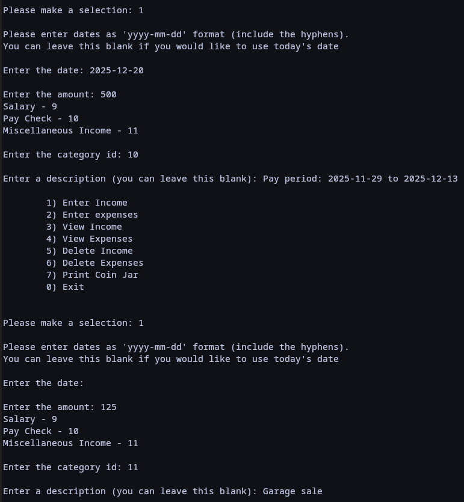
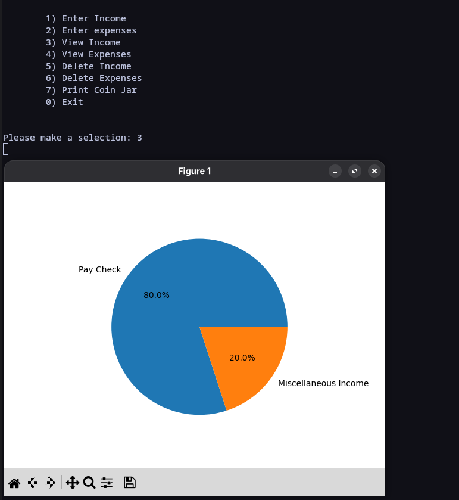
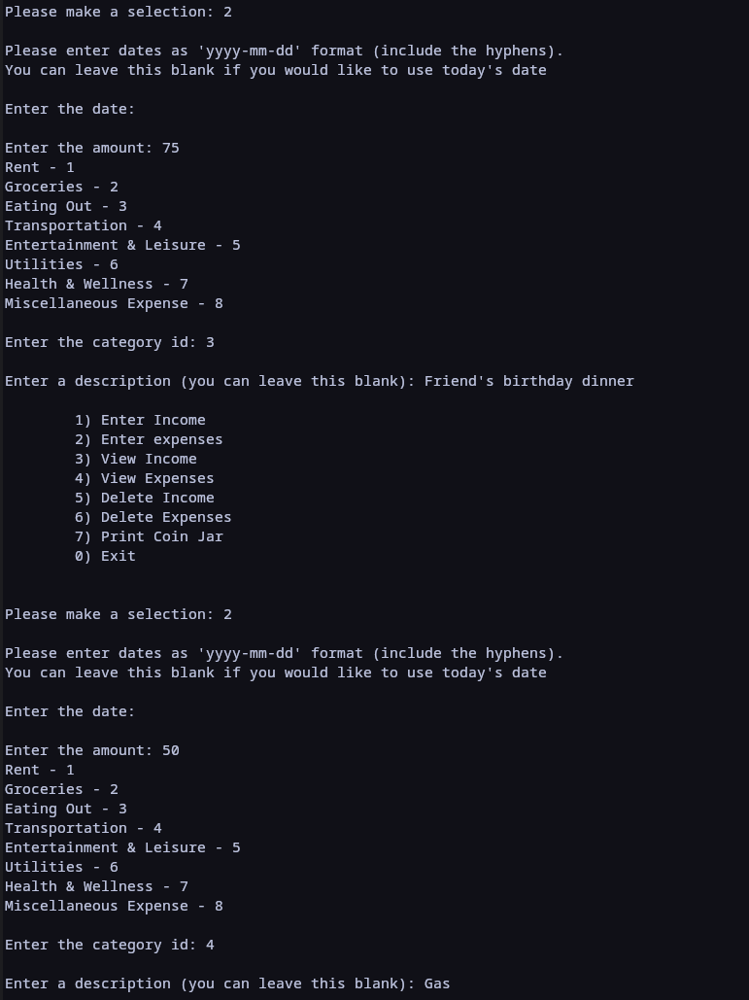
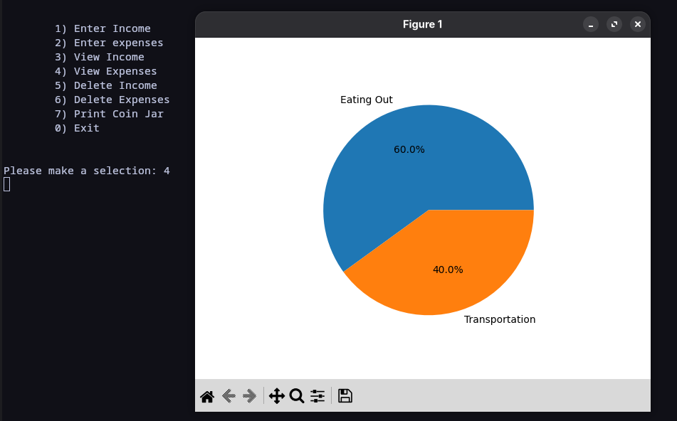
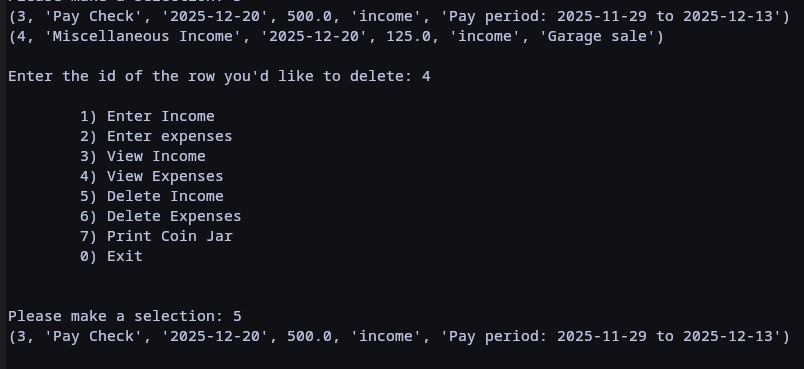
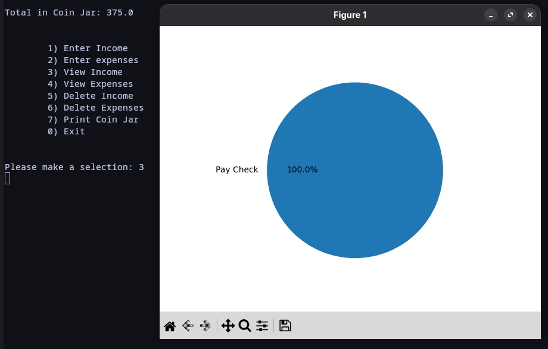

# Coin Jar

## A Financial Tracker and Budgeting application written in Python

Coin Jar is a financial tracker and budgeting application written in Python with SQLite data persistence and category-based summaries and visualizations.

## What can Coin Jar do?

Currently Coin Jar can:
- Accept user financial data via keyboard input (income and expenses)
- Delete data in the event of an input mistake
- Store data in an organized SQLite database for data persistence
- Retrieve data via user selection
- track a running total of the user's savings
- Display summaries and visualizations of income and expense data

### Instructions
1. Clone the repository or download the zip (and extract it)
2. Navigate into the Coin-Jar folder

## Dependencies
- Python 3.6+
- Matplotlib

## Installing Dependencies

### Python
If you are using a Linux system there is a good chance that Python in already
installed. If it is not, you can install it via your distributions package 
manager, or from source with a tarball from the official Python [website](https://www.python.org/downloads/source/). To check if python is installed you can run:   
> python --version   

If installing on Windows or Mac you can use the installer found on Python's website
([Windows](https://www.python.org/downloads/windows/), [Mac](https://www.python.org/downloads/macos/))

### Matplotlib
In the Coin-Jar folder there is a requirements.txt file. If pip is already installed you can simply type: 
> pip install -r requirements.txt 

from within the folder to install all dependencies. You may optionally create a virtual environment before installing using:
> python -m venv name_of_venv

You can then activate the environment on Windows using:
> name_of_venv\Scripts\activate

And on Linux or MacOS using:
> source name_of_venv/bin/activate

Using a virtual environment will not install the packages system wide. If pip is not installed or you would prefer to install the poackage in a different way, see below.

If installing Matplotlib on a linux system, it may be packaged by your distribution 
and in its official repository for install. If this is the case you can simply 
use your distributions pacakage manager.   

For Linux, Windows, and Mac you may also use Python's official tool for installing
and using python packages, pip. With Python already installed check to see if pip
is installed using:   
> pip --version   

If you get an error then pip needs to be installed. Instructions for installing 
pip for for different operating systems can be found [here](https://pip.pypa.io/en/stable/installation/)   

Once pip is installed you are ready to install Matplotlib. Matplotlib can be installed
by running:   
> python -m pip install matplotlib   

If encountering permission issues on Windows try opening the shell and administrator

## Running Coin-Jar 
Navigate to the src folder within the Coin-Jar folder. To run Coin Jar type:
> python3 coin_jar.py

and press enter.

When opening Coin Jar you will be greeted with your coin jar total and a selection menu

To add income select the respective number listed in the menu

Here you will be prompted to enter some data: the date (optional), the amount, the sub-category of income, and a description (optional). This example shows two types of income being entered.

To view the data that was just entered select 'View Income'.

A pie chart will appear and display the income type and what percentage of total income it makes up.

Expenses can be entered the same way with the same style of data entry to follow:

Like income, expenses also can be viewed with a pie chart visualizartion

Should you need to delete an entry, simply select the relevant option, Here we will delete income

After adding all the income and expenses together and deleting an income entry the coin jar total has been updated, as well as the data and chart for income.

